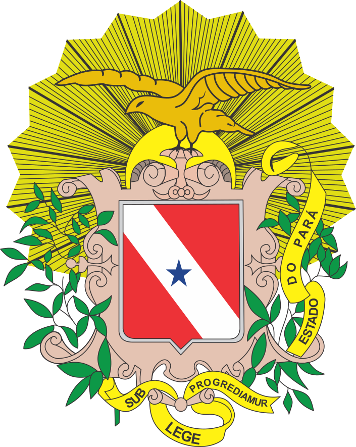

# 🏛️ Portal PGE-PA - Sistemas da Procuradoria-Geral do Estado do Pará

<div align="center">
  
  
  [](https://reactjs.org/)
  [](https://www.typescriptlang.org/)
  [](https://vitejs.dev/)
  [](https://tailwindcss.com/)
  
  **Portal moderno e responsivo para acesso aos sistemas da Procuradoria-Geral do Estado do Pará**
</div>

---

## 📋 Sobre o Projeto

O **Portal PGE-PA** é uma aplicação web moderna desenvolvida para centralizar o acesso aos sistemas da Procuradoria-Geral do Estado do Pará. Com design contemporâneo e interface intuitiva, oferece uma experiência de usuário premium com animações suaves e efeitos visuais sofisticados.

### 🎯 Objetivo

Facilitar o acesso dos servidores e usuários aos principais sistemas da PGE-PA através de uma interface unificada, moderna e responsiva.

## ✨ Características Principais

### 🎨 **Design Moderno**
- **Glass Morphism**: Efeitos de vidro com backdrop-blur
- **Gradientes Dinâmicos**: Paleta azul → índigo → roxo usando OKLCH
- **Animações Suaves**: Transições de 300ms e efeitos personalizados
- **Padrões Geométricos**: Background animado com elementos decorativos

### 🚀 **Performance**
- **Vite**: Build tool ultra-rápido
- **React 18**: Concurrent features e Suspense
- **TypeScript**: Type safety e melhor DX
- **Lazy Loading**: Carregamento otimizado de componentes

### 📱 **Responsividade**
- **Mobile First**: Design adaptável para todos os dispositivos
- **Grid Responsivo**: 1-4 colunas baseado no tamanho da tela
- **Touch Friendly**: Interações otimizadas para dispositivos móveis

### 🎭 **Experiência do Usuário**
- **Navegação Intuitiva**: Interface limpa e organizada
- **Feedback Visual**: Hover states e animações interativas
- **Acessibilidade**: Contraste adequado e navegação por teclado

## 🛠️ Tecnologias Utilizadas

### **Frontend**
- **React 18.3** - Biblioteca para interfaces de usuário
- **TypeScript 5.x** - Superset tipado do JavaScript
- **Vite 5.x** - Build tool e dev server
- **React Router DOM** - Roteamento client-side

### **Estilização**
- **Tailwind CSS 3.x** - Framework CSS utility-first
- **Class Variance Authority** - Gerenciamento de variantes de componentes
- **Radix UI** - Componentes acessíveis e customizáveis

### **Ferramentas de Desenvolvimento**
- **ESLint** - Linting e qualidade de código
- **PostCSS** - Processamento de CSS
- **Autoprefixer** - Prefixos CSS automáticos

## 🏗️ Arquitetura do Projeto

```
src/
├── assets/           # Imagens e recursos estáticos
├── components/       # Componentes reutilizáveis
│   ├── ui/          # Componentes base (Button, etc.)
│   └── components_project/ # Componentes específicos do projeto
├── lib/             # Utilitários e configurações
├── pages/           # Páginas da aplicação
│   ├── app/         # Páginas principais
│   └── layout/      # Layouts da aplicação
└── styles/          # Estilos globais e CSS customizado
```

## 🚀 Instalação e Execução

### **Pré-requisitos**
- Node.js 18+ 
- npm ou yarn

### **Instalação**

```bash
# Clone o repositório
git clone https://github.com/seu-usuario/portal-pge-pa.git

# Acesse o diretório
cd portal-pge-pa

# Instale as dependências
npm install
```

### **Execução**

```bash
# Desenvolvimento
npm run dev

# Build para produção
npm run build

# Preview da build
npm run preview

# Linting
npm run lint
```

## 🎨 Sistemas Integrados

O portal oferece acesso direto aos seguintes sistemas:

| Sistema | Descrição | Status |
|---------|-----------|--------|
| **SIGESCON** | Sistema de Gestão de Contratos | ✅ Ativo |
| **SIDA** | Sistema de Inteligência da Procuradoria da Dívida Ativa | ✅ Ativo |
| **LEXPGE** | Base de Atos Normativos da PGE-PA | ✅ Ativo |
| **BUSCA DOE** | Sistema de Busca de Diários Oficiais | ✅ Ativo |
| **SUPORTE DTI** | Sistema de Suporte da DTI | ✅ Ativo |
| **CLOUD PGE** | Sistema de Armazenamento de Arquivos | ✅ Ativo |
| **GDAP** | Gratificação de Desempenho de Apoio à Procuradoria | ✅ Ativo |
| **e-CONSULTA** | Sistema de Consulta de Processos do e-PGE | ✅ Ativo |

## 🎯 Funcionalidades

### **Interface Principal**
- ✅ Grid responsivo de sistemas
- ✅ Cards com glass morphism
- ✅ Animações de hover e click
- ✅ Indicadores de status

### **Navegação**
- ✅ Header com glass morphism
- ✅ Logo animado com efeitos
- ✅ Menu responsivo para mobile
- ✅ Breadcrumbs e navegação contextual

### **Experiência Visual**
- ✅ Background com padrões geométricos
- ✅ Blobs animados decorativos
- ✅ Gradientes dinâmicos
- ✅ Transições suaves

## 🔧 Configuração

### **Variáveis de Ambiente**
```env
VITE_API_URL=https://api.pge.pa.gov.br
VITE_APP_TITLE=Portal PGE-PA
VITE_APP_VERSION=1.0.0
```

### **Customização de Cores**
As cores podem ser ajustadas no arquivo `src/index.css`:

```css
:root {
  --primary-gradient: linear-gradient(135deg, #3b82f6 0%, #8b5cf6 100%);
  --accent-gradient: linear-gradient(135deg, oklch(0.70 0.15 260) 0%, oklch(0.65 0.20 280) 100%);
}
```

## 📊 Performance

### **Métricas de Performance**
- **First Contentful Paint**: < 1.5s
- **Largest Contentful Paint**: < 2.5s
- **Cumulative Layout Shift**: < 0.1
- **Time to Interactive**: < 3.0s

### **Otimizações Implementadas**
- ✅ Code splitting automático
- ✅ Lazy loading de componentes
- ✅ Otimização de imagens
- ✅ Minificação de CSS/JS
- ✅ Compressão gzip

## 🔒 Segurança

- ✅ **HTTPS Only**: Todas as comunicações criptografadas
- ✅ **CSP Headers**: Content Security Policy implementado
- ✅ **XSS Protection**: Sanitização de inputs
- ✅ **CORS**: Configuração adequada de CORS

## 🤝 Contribuição

### **Como Contribuir**

1. **Fork** o projeto
2. Crie uma **branch** para sua feature (`git checkout -b feature/AmazingFeature`)
3. **Commit** suas mudanças (`git commit -m 'Add some AmazingFeature'`)
4. **Push** para a branch (`git push origin feature/AmazingFeature`)
5. Abra um **Pull Request**

### **Padrões de Código**
- Use **TypeScript** para type safety
- Siga as convenções do **ESLint**
- Mantenha componentes **pequenos e focados**
- Documente **props e interfaces**

## 📝 Licença

Este projeto é propriedade da **Procuradoria-Geral do Estado do Pará** e está licenciado para uso interno da instituição.

---

## 👥 Equipe de Desenvolvimento

### **Diretoria de Tecnologia da Informação e Governança Digital (DTIGD)**
- **Desenvolvimento**: Equipe DTIGD
- **Design**: Equipe DTIGD  
- **Infraestrutura**: Equipe DTIGD

---

## 📞 Suporte

Para suporte técnico ou dúvidas sobre o sistema:

- 🌐 **Portal**: [Portal PGE-PA](http://portal.pge.pa.gov.br)
- 📧 **Email**: suporte@pge.pa.gov.br
- 🎫 **Sistema de Suporte**: [Suporte DTI](http://suportedti.pge.pa.gov.br/)

---

<div align="center">
  <p><strong>Desenvolvido com ❤️ pela DTIGD - PGE-PA</strong></p>
  <p>Copyright © 2024 Procuradoria-Geral do Estado do Pará</p>
</div>
